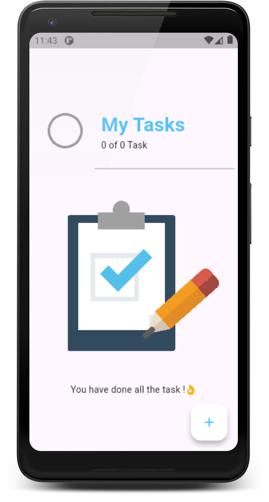
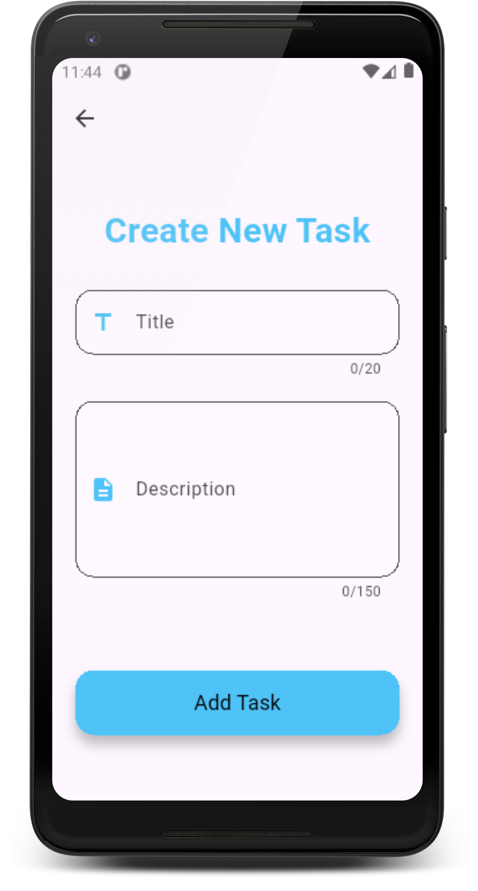
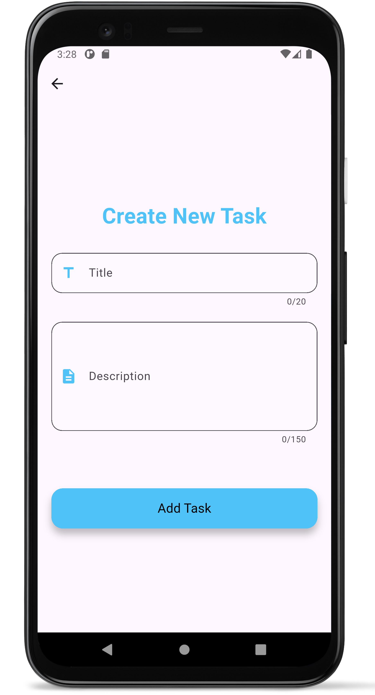
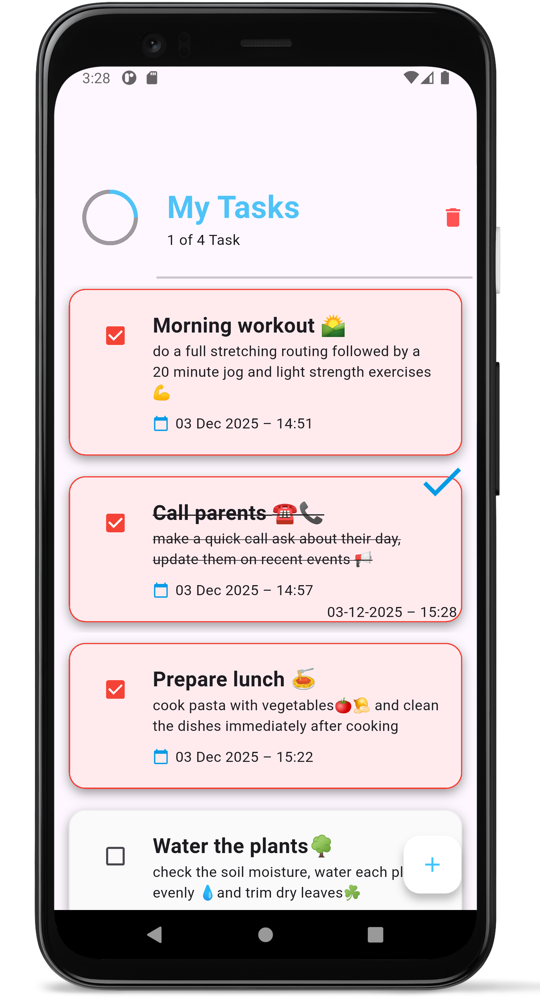

## 📱 to_do_list_app
A modern and clean Flutter To-Do List Application that helps users organize tasks, stay productive, and manage daily routines with smooth animations and offline storage.

## ✨ Features

- ➕ Add Tasks: Create tasks with title & description.
- ✏️ Edit Tasks: Update existing tasks anytime.
- ✅ Mark as Completed: Easily track what’s done with a completion timestamp.
- 🗑️ Delete Multiple Tasks: Smooth delete animation .
- ⏰ Date Tracking: View created date & done date.
- 📚 Offline Storage: All tasks stored locally using Hive.
- 🔄 Real-Time State Updates:Powered by BLoC state management.
- 🎯 Clean Architecture: Easy to maintain & scalable.
- 🎨 Modern UI: Beautiful cards, shadows, and responsive layout.
- 🧪 Error Handling: User-friendly success/error messages.
- 🧩 Lottie Animations: For empty states and visual feedback.

## ✨Some ScreenShots

  
  
  

  

